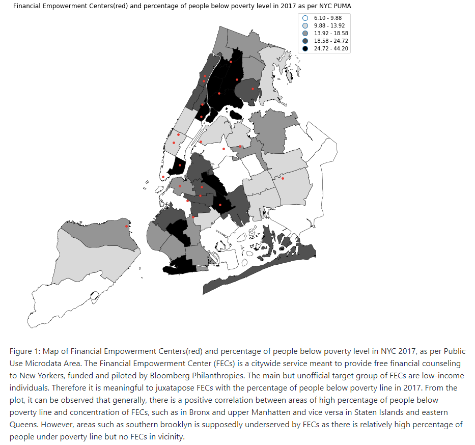

# Assignment 1

### What I did
Completed task 1 and 2 mostly by myself, working in close collaboration with Mei @yg833 for these two segments! Don't understand what was going on for Task 3. 

### Groupmates & my contributions

Consulted many people throughout this assignment. Shoutout to Mei @yg833, Jerome (jl9489), Andrea(ah4412), Fekade Brook (fb1182), Sam (sjf374). 

Many thanks to Rachel @rms818 whom guided me through portions of Task 3. 

# Assignment 2

### What I did

Made adjustments to the plot from Homework 8 according to the review received, which is to include the caption in the image too. The code has also been edited to print the caption automatically after the plot is rendered instead of manually inputting the caption after the plot. 

### Groupmates & my contributions

Did this work on my own, as specified by the instructions. 