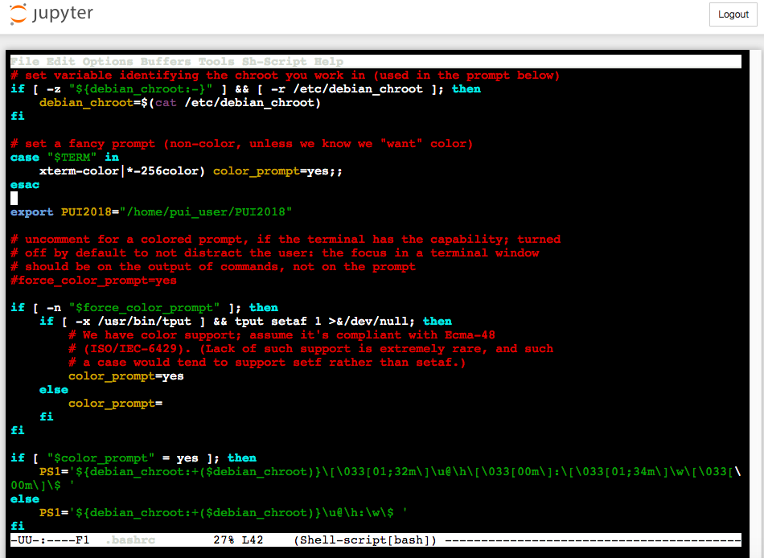
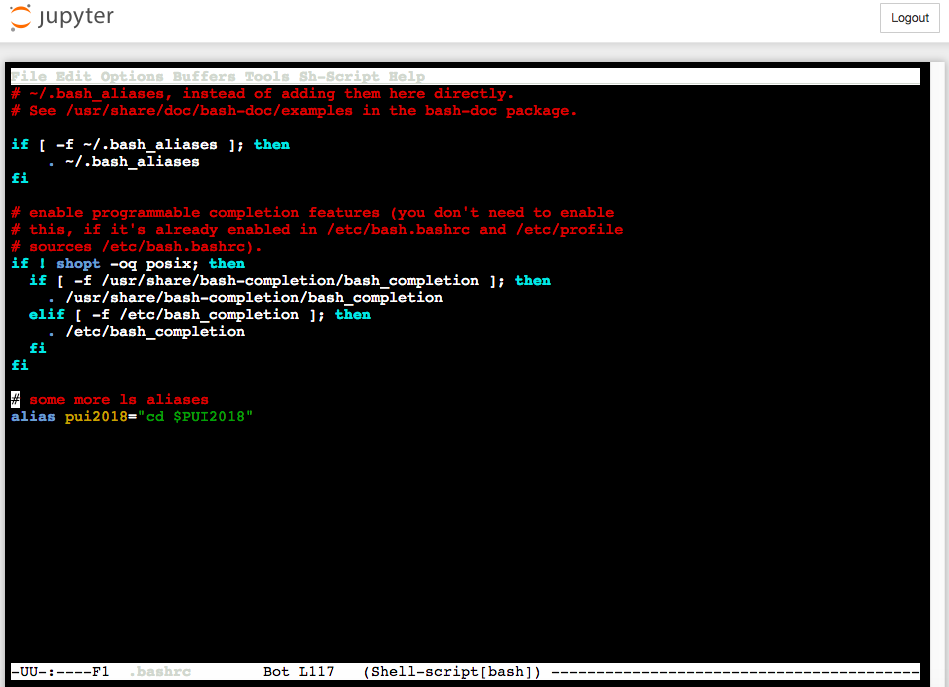
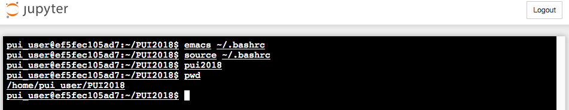

# Homework 1

This repository contains the screenshots of the work I did for homework 1, as well as the extra credit ipyton notebook.  

### What I did to set up the environment

1) Log in to CUSP ADRF
2) Open up a new terminal
3) Ensure that terminal is working on the correct directory using the _pwd_ function
4) Create a new folder called "PUI2018" using the _mkdir_ function ie. _mkdir PUI2018_ 
5) Open bashrc ie. _vi ~/.bashrc_
6) In the bashrc file, scroll to the bottom to add _export_ and _alias_ as seen in the screenshots attached below: 

7) Exit vi editor and double check if the alias is set up correctly:

### Extra Credit Homework

In ipython notebook format. Did not complete the challenge part cause it was beyond my league :(  