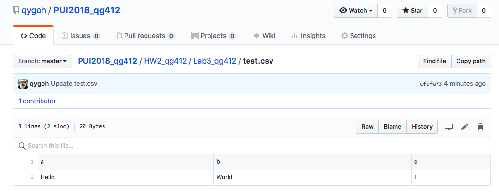
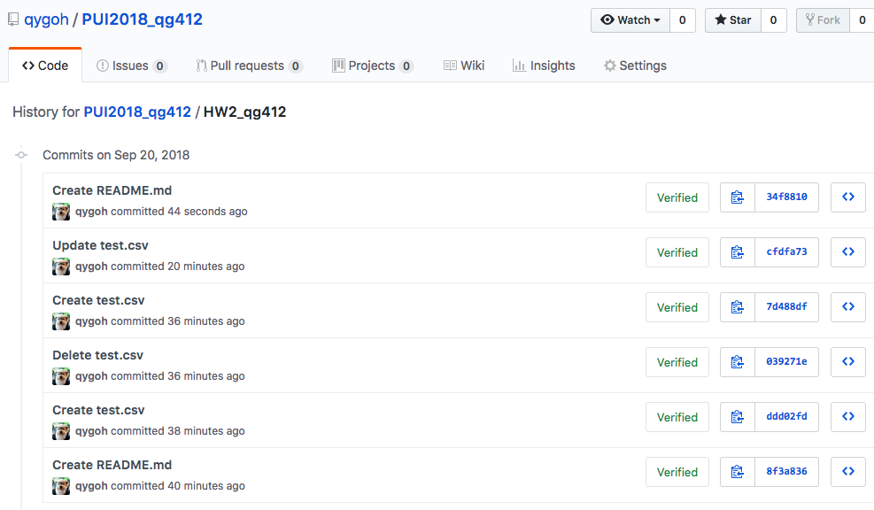
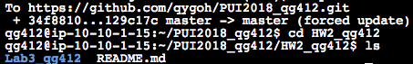
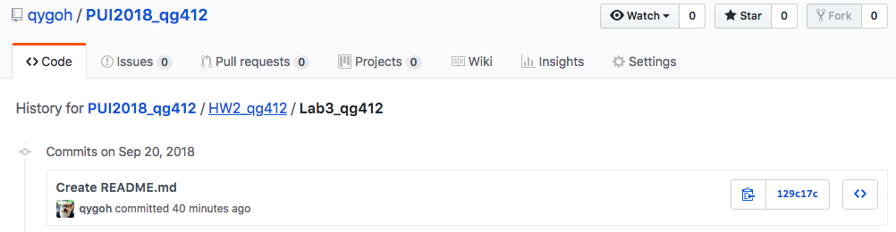

#Assignment 1 or Part 1 of Homework 3

On how to remove files permanently on Github.

###Screenshots

1) The repo screenshot of my _test.csv_ file: 

2) The Lab3 folder history screenshot showing the creation of the _test.csv_ file: 

3) The screenshot of the ls function after inputting the code to remove history: 

4) Screenshot of the Lab3 folder's History with no traces of _test.csv_ file: 

Tadaaa!