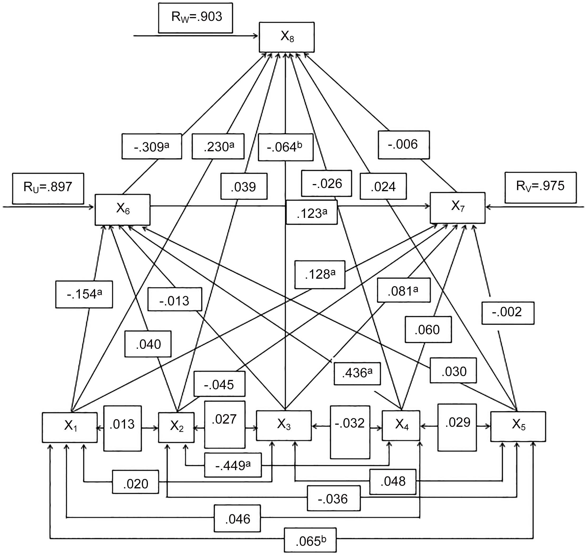
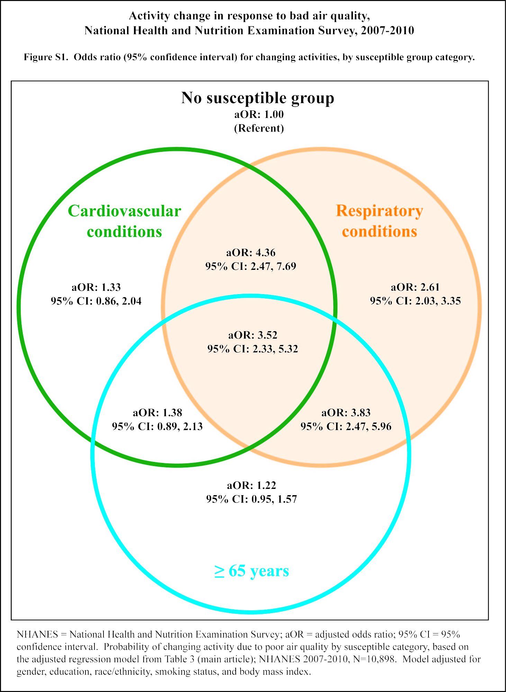

# Assignment 1 
On reviewing others' proposal. 

### What I did
not done yet. sorry partner i think i'll ask for extension for this homework. 

### Groups and my contribution
I did this piece of work on my own, as designated by the instructions. 

# Assignment 2 
On understanding how academic papers utilize statistical tests. No specific files for this assignment, it is all in this markdown. 

### What I did

1) Chose 3 statistical tests - ANOVA, Path Analysis and Logistic Regression

2) Summarized 3 papers from PLOS ONE for each of the chosen tests in the table below: 

| **Statistical Analyses**	|  **Independent Variable(s)**  |  **IV type(s)** |  **Dependent Variables(s)**  |  **DV type(s)**  |  **Control Var** | **Control Var type**  | **Question to be answered** | **_H0_** | **Alpha** | **Link to paper**| 
|:----------:|:-------|:------------|:-------------|:-------------|:------------|:------------- |:------------------|:----:|:-------:|:-------|
ANOVA	| 2. IV1: Sleep for 12 hours. IV2: Wake for 12 hours | Categorical | 1: Performance in The Iowa Gambling Task (IGT) | Categorical | 1: Sleep and wake for 12 hours respectively | Categorical |	Does intervening sleep between sessions enhance performance in IGT? | IGT Performance test groups <= IGT Performance control group | 0.05 | [Post Learning Sleep Improves Cognitive-Emotional Decision-Making: Evidence for a ‘Deck B Sleep Effect’ in the Iowa Gambling Task](https://journals.plos.org/plosone/article?id=10.1371/journal.pone.0112056) |
Path Analysis | 7. (X1)women age, (X2) place of residence, (X3)religion, (X4) socioeconomic status, (X5) use of family planning methods, (X6) women education, (X7) age at first marriage | Categorical and Continuous | 1: Number of unwanted births | Continuous | NIL | NIL | To determine the direct, indirect and total effects of socio-demographic factors on unwanted births. | All variables have no impact on number of unwanted births as well as no correlation with each other | 0.05 | [Correlates of Unwanted Births in Bangladesh: A Study through Path Analysis](https://journals.plos.org/plosone/article?id=10.1371/journal.pone.0164007) |
Logistic Regression |3. Respiratory conditions, cardiovascular conditions and older age | Categorical | 1: Activity Change | Categorical | NIL | NIL | What is the extent to which susceptible individuals changed activities due to bad air quality? | Good Air Quality Activity type = Bad Air Quality Activity Type | 0.05 | [Activity Change in Response to Bad Air Quality, National Health and Nutrition Examination Survey, 2007–2010](https://journals.plos.org/plosone/article?id=10.1371/journal.pone.0050526) |
|||||||||

3) Provide screenshots of the main plot of the 3 selected papers: 

Figure 1: ANOVA Paper's main plot. Subplot A shows that overall, the sleep group improved the most compared to sleep-wake and wake groups. Subplot B shows the choices made by participants for each deck in IGT: Choice of deck A and B are considered bad choices, while choices C and D are considered good choices. Improvement is reflected by a negative percent change in deck A and B and positive percent change in deck C and D.

Figure 2: Path Analysis Paper's main plot. There are in total 7 predictors analyzed: (X1)women age, (X12) place of residence, (X3)religion, (X4) socioeconomic status, (X5) use of family planning methods, (X6) women education, (X7) age at first marriage for their effect on the dependent variable (X8)unwanted births. This plot summarizes the findings that unwanted births were positively correlated with women age and place of residence while it is inversely significantly correlated with education and social status. It also shows that the total effects of endogenous variables such as women age, place of residence and use of family planning methods have favorable effect on unwanted births.

Figure 3: Logistic Regression Paper's main plot. This plot summarizes the results finding as it reflects all the probabilities of changing activity due to poor air quality by each susceptible category of respiratory conditions, cardiovascular conditions and older age.

### Groups and my contributions
Did this on my own, but double checked my answers with kloe @ kyn227, vaidehi @ vvt221 and rachel @ rms818. 

# Assignment 3
On reproducing results of existing literature. The main file for this assignment is _HW5_qg412_. 

### What I did
1) Download Prof Bianco's skeleton notebook and made further changes to it
2) Read up on Z-test and Chi-square test
3) Wrote the null hypothesis for Recidivism 
4) Modified Prof Bianco's code to answer the question for Z-Test
5) Filled in contingency table for chi-square test
6) Created a user-defined function that is capable of conducting chi-square test when called

### Groups and my contribution
I managed to do this by myself! Yaye. Double checked my answers with Vaidehi @ vvt221. 

# Assignment 4
On. The main file for this assignment is _Assignment 4_qg412_. 

### What I did

### Groups and my contribution
This was hard. still working on it. 

