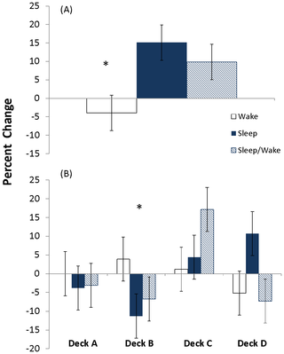

# Assignment 2 
On understanding how academic papers utilize statistical tests. 

### What I did

1) Chose 3 statistical tests - ANOVA, Multiple regression and logistic regression

2) Summarized 3 papers from PLOS ONE for each of the chosen tests in the table below: 

| **Statistical Analyses**	|  **Independent Variable(s)**  |  **IV type(s)** |  **Dependent Variables(s)**  |  **DV type(s)**  |  **Control Var** | **Control Var type**  | **Question to be answered** | **_H0_** | **Alpha** | **Link to paper**| 
|:----------:|:-------|:------------|:-------------|:-------------|:------------|:------------- |:------------------|:----:|:-------:|:-------|
ANOVA	| 2. IV1: Sleep for 12 hours. IV2: Wake for 12 hours | Categorical | 1: Performance in The Iowa Gambling Task (IGT) | Categorical | 1: Sleep and wake for 12 hours respectively | Categorical |	Does intervening sleep between sessions enhance performance in IGT? | IGT Performance test groups <= IGT Performance control group | 0.05 | [Post Learning Sleep Improves Cognitive-Emotional Decision-Making: Evidence for a ‘Deck B Sleep Effect’ in the Iowa Gambling Task](https://journals.plos.org/plosone/article?id=10.1371/journal.pone.0112056) |

3) Provided screenshots of the main plot of the 3 selected papers: 

Figure 1: ANOVA Paper's main plot. Subplot A shows that overall, the sleep group improved the most compared to sleep-wake and wake groups. Subplot B shows the choices made by participants for each deck in IGT: Choice of deck A and B are considered bad choices, while choices C and D are considered good choices. Improvement is reflected by a negative percent change in deck A and B and positive percent change in deck C and D.

Figure 2: Paper's main plot. 

Figure 3: Paper's main plot. 
