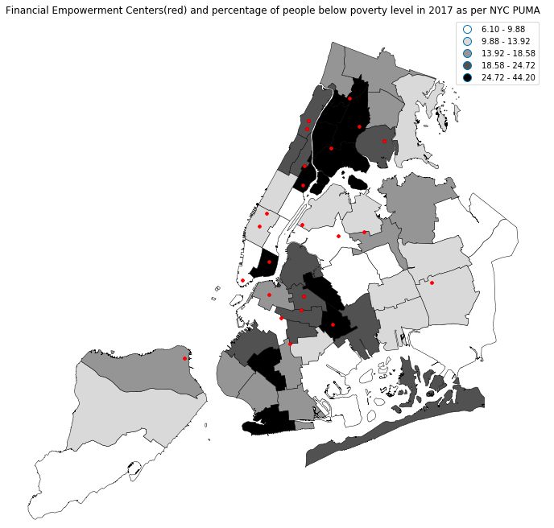

# HW8 Assignment 1

### What I did

1) Searched for interesting datasets that I can plot
2) Downloaded and cleaned the selected datasets
3) Displayed it as a plot below: 

Figure 1: Map of Financial Empowerment Centers(red) and percentage of people below poverty level in NYC 2017, as per Public Use Microdata Area. The Financial Empowerment Center (FECs) is a citywide service meant to provide free financial counseling to New Yorkers, funded and piloted by Bloomberg Philanthropies. The main but unofficial target group of FECs are low-income individuals. Therefore it is meaningful to juxatapose FECs with the percentage of people below poverty line in 2017. From the plot, it can be observed that generally, there is a positive correlation between areas of high percentage of people below poverty line and concentration of FECs, such as in Bronx and upper Manhatten and vice versa in Staten Islands and eastern Queens. However, areas such as southern brooklyn is supposedly underserved by FECs as there is relatively high percentage of people under poverty line but no FECs in vicinity.

### Additional comments on reproducibility and Data Privacy from qg412: 

In the spirit of reproducibility, all data sources must be made avaliable and users must be able to take the same line of codes to generate the same plot of results. 

However, there is no way to read data from the American Fact Finder directly from an url link. Instead, data must be manually downloaded and uploaded into the enduser's own cloud server/local drive.

The unfortunate construct of American Fact Finder and its data does not render this piece of work un-reproducible though, as the enduser can still access the main url to download the raw data. The plots are still reproducible using the same lines of code.  

For convenience sake, the raw data from American Fact finder will be provided on Github. I am aware of the general rule of thumb that no data should be uploaded into github due to data privacy concerns, but this is one instance where the data is already publically avaliable online, thus this does not violate any data privacy concern too.  

### Groupmates and my contributions

Did this by myself as specified by instructions. 

# HW8 Assignment 2

### What I did

The authorea report @ https://www.authorea.com/users/249380/articles/335460-hw8-assignment-2

### Groupmates and my contributions

Worked with Mei @ yg833 and Sam @sjf374 for this assignment. 